# Insaniquarium - Remastered Mod

**Mods for the original *Insaniquarium! Deluxe* on Steam.** Insaniquarium - Remastered Mod adds new features to the
game you already own: online co-op for 2-4 players, extra modes, achievements, a large sharp window and more.
Drop a few files into the game folder and play as usual. It never changes the game's own files, and removing it is
deleting what you added.

Unofficial fan project, not affiliated with PopCap Games or EA. No game files are included: you need your own copy.

## Screenshots
| | |
|---|---|
| 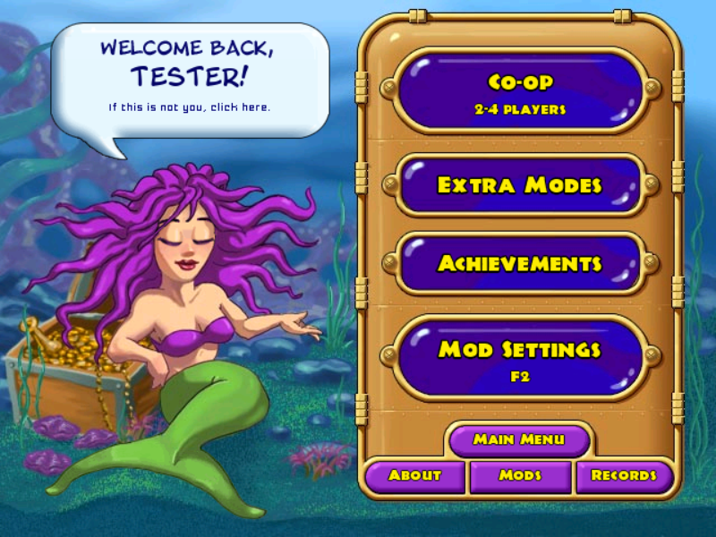 **The Remastered page:** the mod's screens, from the main menu | 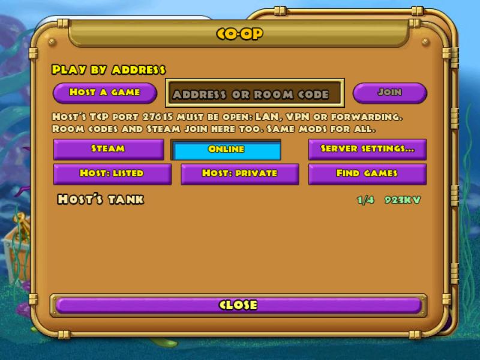 **Online co-op:** host or join through the public server, no setup |
| 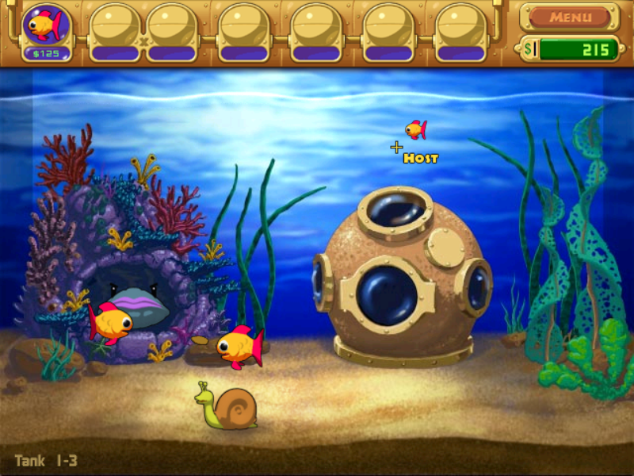 **In a co-op game:** every player's pointer, name and avatar | 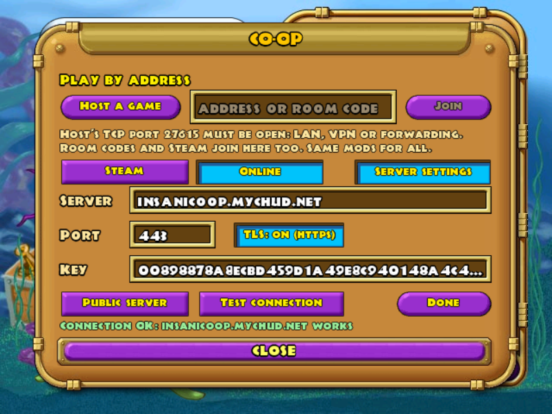 **Server settings:** the public server, or your own, with a connection test |
| 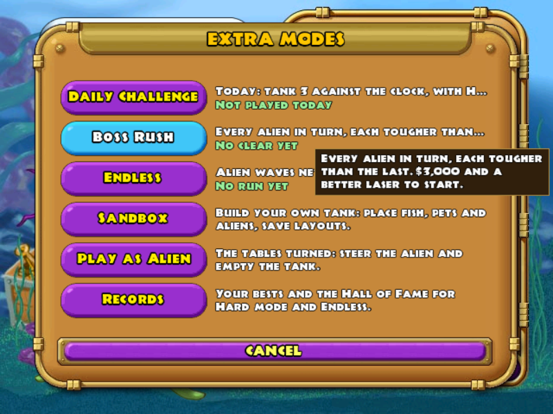 **Extra Modes:** daily challenge, boss rush, endless, sandbox, play as the alien | 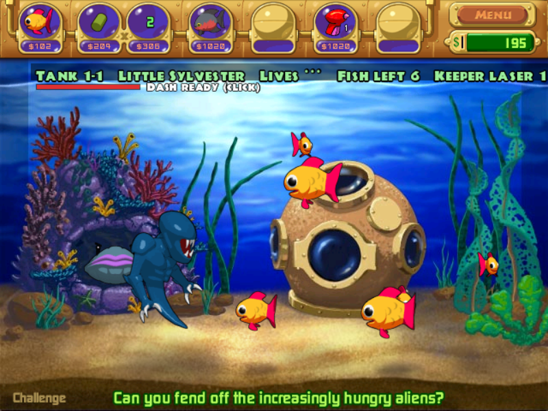 **Play as the Alien:** you steer the alien, a computer keeper fights back |
| 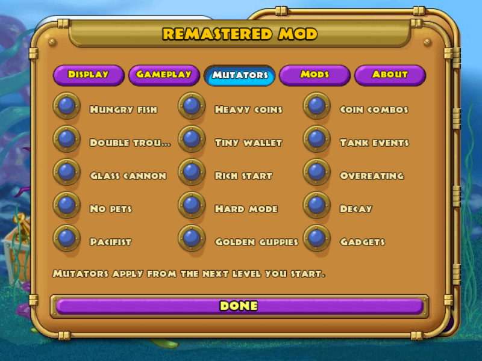 **15 mutators** to change the rules | 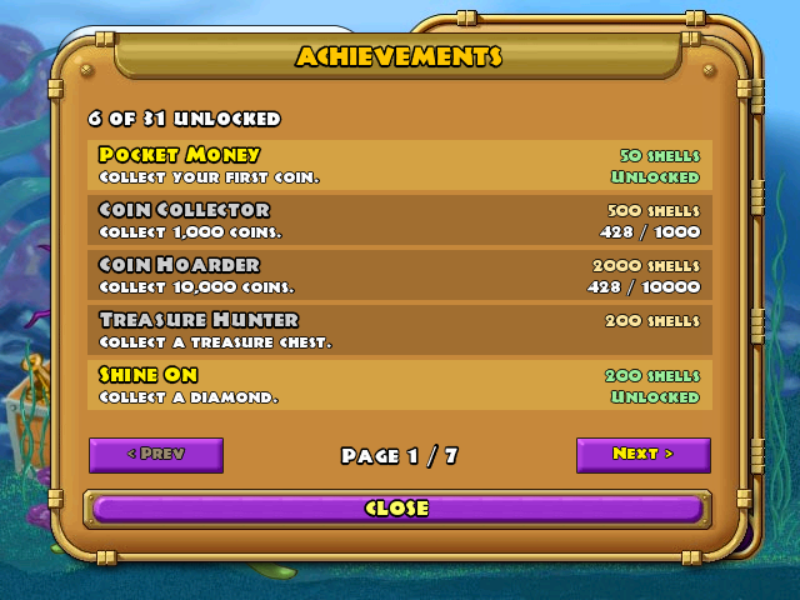 **31 achievements** with shell rewards |
| 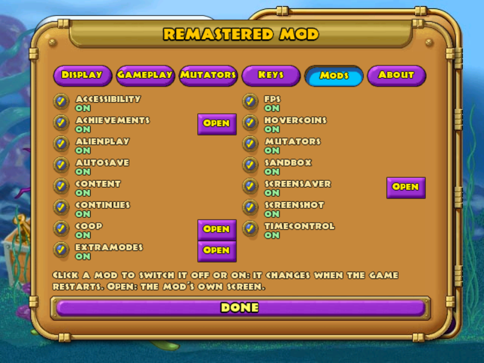 **The Mods page:** every mod, on/off, and its own screen | 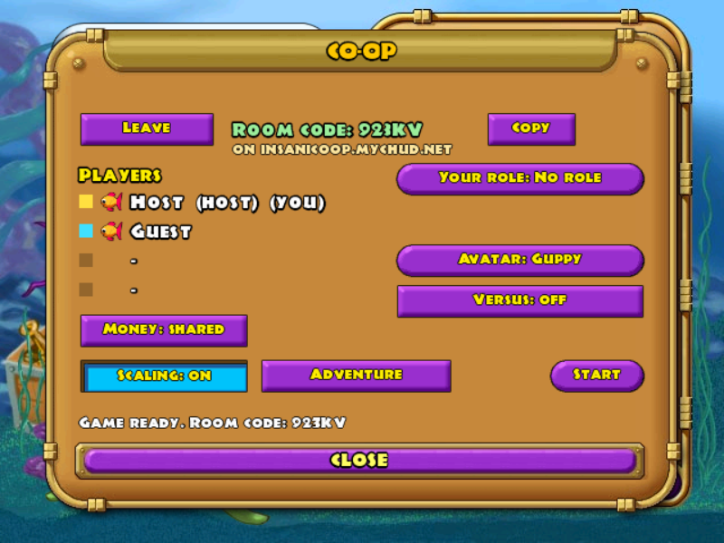 **The co-op lobby:** players with their avatars, roles, versus, split money |
| 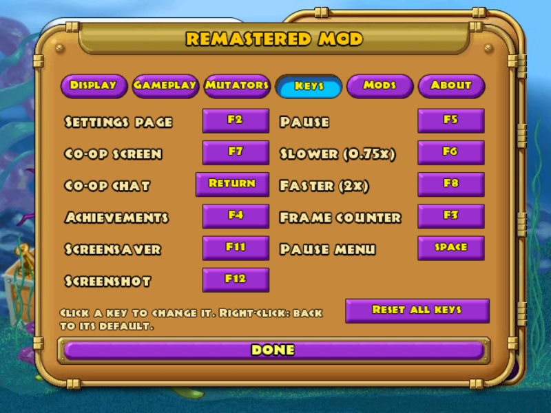 **The Keys tab:** every key, changed with a click, defaults with a right-click | |

## Requirements
- ***Insaniquarium! Deluxe* from Steam** ([store page](https://store.steampowered.com/app/3320/)), installed and run
  once. The mod checks the game's code when it starts; with any other build it stays off and the game runs as normal.
- Windows 10/11, or Linux / Steam Deck through Proton.
- Online co-op: an internet connection (the mod's public server is set up by default; nothing to configure).

## Where the files go
| File (from the release zip) | Where it goes |
|---|---|
| `mods\` (all the mods and the default settings) | the game folder: Steam → right-click *Insaniquarium! Deluxe* → **Manage → Browse local files** (usually `C:\Program Files (x86)\Steam\steamapps\common\Insaniquarium Deluxe`) |
| `ddraw.dll` (the loader) | the same game folder, **and** the folder the Steam version actually runs the game from: `C:\ProgramData\PopCap Games\Insaniquarium`. `install-steam.bat` (Windows) or `install-steam.sh` (Linux / Steam Deck, into the game's Proton prefix) puts it there for you |
| your own or downloaded mods | `mods\<name>.dll` in the game folder (only `.dll` files directly in `mods\` are loaded) |
| content packs (images, sounds, levels) | a folder inside `mods\` (see [DEVELOPING.md](DEVELOPING.md#content-packs)) |

Step by step for Windows, Linux and Steam Deck: **[docs/INSTALL.md](docs/INSTALL.md)**. The title screen then says
"Insaniquarium - Remastered Mod is on".

## Documentation
| | |
|---|---|
| [docs/INSTALL.md](docs/INSTALL.md) | installing, updating and uninstalling (Windows, Linux, Steam Deck) |
| [DEVELOPING.md](DEVELOPING.md) | building from source, and **making your own mods** (the API, hooking game functions, testing, co-op rules) |
| [docs/MOD-MANAGER.md](docs/MOD-MANAGER.md) | how a mod shows up on the **Mods** page (description, on/off, Open button) and the Remastered page |
| [docs/SERVER.md](docs/SERVER.md) | **hosting your own co-op server** (Docker: Nakama + Postgres, HTTPS) and pointing the game at it |
| [docs/STEAM.md](docs/STEAM.md) | how the Steam release runs the game, and co-op over Steam |
| [docs/GAME-UPDATES.md](docs/GAME-UPDATES.md) | which game functions each mod uses, and what to do if the game is ever updated |
| [docs/ROADMAP.md](docs/ROADMAP.md) | what's done and what's planned |
| [examples/](examples/) | a minimal mod and a template to start from |

## Features
| Mod | What it does | Keys |
|---|---|---|
| **settings** | The settings page (every option below, with tabs; every key on the **Keys** tab), the main menu's **Remastered** page, the loaded-mods screen (switch mods off or on, restart the game) | **F2** |
| **hovercoins** | Coins, gems and treasure are collected when the pointer passes over them, no clicking needed | none |
| **extramodes** | **Extra Modes** on the Remastered page: a **Daily Challenge** (the same tank and two mutators for everyone that day), **Boss Rush** (every alien in turn, tougher each time), **Endless** (waves that never stop), and **Records** with Hall of Fame tables | none |
| **sandbox** | The game's hidden sandbox as a proper mode (from Extra Modes): a palette places fish, aliens and pets where you click; remove, clear, backdrops, hunger off, three save slots | **Tab** palette |
| **alienplay** | **Play as the Alien** (from Extra Modes): 20 stages where you steer the alien and eat the fish while a computer keeper shoots back | click to dash |
| **content** | Content packs: a folder in `mods\` can replace the game's images, sounds and music (the game's files are never changed) and change what levels start with (`content\levels.json`). See DEVELOPING.md | none |
| **autosave** | Saves the level in progress and your profile every 2 minutes and whenever the game pauses (window loses focus, menu opens), so a crash or power cut loses little | none |
| **continues** | When all your fish die, spend shells to get two guppies and keep going: 500 shells, then 1,000, 1,500... until you return to the main menu. Only offered when you have the shells | none |
| **accessibility** | A red **!** over hungry fish, and each coin's value under it (no need to tell silver, gold and gems apart by colour) | none |
| **achievements** | 31 achievements (coins, aliens, levels, pets, modes...) with shell rewards paid on the main menu; a banner when one unlocks; the list from **Achievements** on the Remastered page. Progress is saved per profile next to your saves | **F4** list |
| **coop** | Co-op for 2-4 players over the network: **Co-op** on the Remastered page (or F7), one player hosts and the others join: **Online** through the mod's public server (a listed game, or a private one joined by its room code; no ports to open, nothing to set up), through **Steam**, by address, or through **your own server** (docs/SERVER.md). Everyone plays the host's profile (your own saves are never touched; shells you earn come home with you). Roles (Feeder, Gunner, Collector, Shopper), chat (Enter, in the game and the lobby; lines fade after 10 s), pings (middle click), rescue a starving fish together, tougher tanks for more players (host's choice), an avatar on your pointer (a pet or fish portrait), **split money** (host's choice: everyone has their own money; coins pay whoever clicked them), join a game that has already started (while there's room), and **Versus** (host's choice: the first player to join steers the aliens with the pointer, click to dash, and tries to eat every fish). The host is in charge: only the host pauses, changes the speed, opens the menu or answers dialogs. Everyone needs the same mods | **F7**, Enter, middle click |
| **mutators** | 15 optional rule changes for Adventure, Time Trial and Challenge, switched on one by one in the settings: hungry fish, double trouble (aliens come in twins), glass cannon, no pets, pacifist, heavy coins, tiny wallet ($2,500 cap), rich start ($1,000), hard mode, golden guppies, coin combos, tank events (feeding frenzy, lights out, currents), overeating, decay (corpses float until clicked away), gadgets (buy an auto-feeder, coin magnet and alien alarm) | none |
| **fps** | A frame counter in the top-left corner | **F3** |
| **screenshot** | Saves the game window as a PNG in the game folder's `screenshots` folder | **F12** |
| **timecontrol** | Pause the game, or play at 0.75x or 2x speed. A small label in the corner shows the speed. Works in every mode that has a tank (Adventure, Time Trial, Challenge, Virtual Tank); menus always run at normal speed. In co-op only the host can change it, for everyone | **F5** pause / resume, **F6** 0.75x (again: normal), **F8** 2x (again: normal) |
| **screensaver** | Watch your Virtual Tank as the game's own screensaver: **Open** on the Mods page, or **F11** on the main menu. It fills the screen in a window (no screen-mode switch, which fails on some Linux desktops) while the game waits minimised, and the game comes back when you move the mouse or press a key. On Linux and the Steam Deck it runs inside the game's own Proton prefix, so it finds your saves | **F11** |

**The Remastered page:** the **Remastered** button on the main menu (bottom left) turns the menu's button panel into
the mod's: **Co-op**, **Extra Modes**, **Achievements**, **Mod Settings**, **About**, **Mods** (the loaded mods,
switch them off or on) and **Records**; **Main Menu** goes back. The settings page also opens with **F2** anywhere.

### Keys
Every key can be changed on the settings page's **Keys** tab: click a key and press the new one (**Esc** keeps the old
one, **Backspace** means no key). **Right-click** a key, or **Reset all keys**, for the defaults. A key used twice gets a
red **!**.

| Key | Does | Where |
|---|---|---|
| **F2** | the settings page | anywhere |
| **F7** | the co-op screen | main menu |
| **F4** | the list of achievements | anywhere but co-op |
| **F11** | the screensaver | main menu |
| **F12** | a screenshot | anywhere |
| **F5** / **F6** / **F8** | pause / 0.75x / 2x (again: back to normal) | in a tank; in co-op only the host, for everyone |
| **F3** | the frame counter | anywhere |
| **Enter** | a chat line (Enter sends it, Esc drops it; only the players in that game see it; lines fade after 10 s) | in a co-op game or its lobby |
| **Space** | the game's own pause dialog (moved to another key there, Space stops opening it) | in a tank |

Built into Insaniquarium - Remastered Mod itself:
- **Window choices** (Display tab of the settings): the game opens in its own **640x480** window by default (also the
  Steam release, which would otherwise start fullscreen). **Large** opens a window as large as your screen allows (2x on
  a 1080p screen, 3x on 1440p...), resizable and maximisable, scaled up sharply with the game's own cursor at the same
  size. **Borderless** fills the whole screen, with black bars at the sides. **Fullscreen** is the game's own fullscreen
  mode.
- **Safe start:** hold **Shift** while the game starts to play without mods this time.
- **Crash protection:** if a mod goes wrong, it's switched off with a message ("... crashed and was switched off") and
  the game keeps going.
- **Save backup:** the first time Insaniquarium - Remastered Mod runs, your profiles are copied to `userdata-before-remastered-mod` (next to the
  game's `userdata` folder) before anything else happens.

What's planned next: [docs/ROADMAP.md](docs/ROADMAP.md).

**Online co-op** goes through the mod's public server (`insanicoop.mychud.net`) by default: host a listed or private
game, or join from the list or with a room code; no ports to open. Groups that prefer their own server can run one
([docs/SERVER.md](docs/SERVER.md)) and enter it in the co-op screen (**Online → Server settings**). Co-op by address
(the host opens a TCP port) and over Steam work too.

**Co-op over Steam** needs Valve's `steam_api.dll`, which isn't in the download (Valve's licence only lets their
partners ship it). Usually there's nothing to do: many Steam games come with one, and the first time you pick Steam,
the mod looks through your Steam libraries for a 32-bit copy that's new enough (from 2020 or later) and uses it where
it is (it remembers which one in `[coop] steam_api=`). If none is found, the co-op screen says so: put a 32-bit
`steam_api.dll` into `mods\coop\`, for example from the `Windows-x86` folder of a
[Steamworks.NET standalone release](https://github.com/rlabrecque/Steamworks.NET/releases). Co-op by address works
without it.

## Which game it needs
*Insaniquarium! Deluxe* from **Steam** (version 1.1, the number on the title screen). Insaniquarium - Remastered Mod
recognises the game by its code (if the game is ever updated, see [docs/GAME-UPDATES.md](docs/GAME-UPDATES.md)); with
any other version it simply stays off and the game runs as normal (the log says so).

## What's in the download
```
ddraw.dll              the Insaniquarium - Remastered Mod loader
install-steam.bat      helper for the Steam version on Windows
install-steam.sh       helper for the Steam version on Linux / Steam Deck
INSTALL.txt            how to install on Windows and Linux
README.txt             this guide;  CHANGELOG.txt  what's new;  LICENSES.txt  licences
mods/
  settings.dll  achievements.dll  coop.dll  extramodes.dll  sandbox.dll  alienplay.dll  content.dll  hovercoins.dll  timecontrol.dll  autosave.dll  continues.dll  accessibility.dll  mutators.dll  fps.dll  screenshot.dll  screensaver.dll
  remastered-mod.default.ini   the default settings: the game makes your remastered-mod.ini from them
  remod-files.txt      the mod's own files (updates remove what a version dropped; uninstalling removes only these)
```
(Building it yourself: `./build.sh` puts these files in `build/dist/`; `tools/package.sh` makes the zip.)

## Installing
Full step-by-step guide: **[docs/INSTALL.md](docs/INSTALL.md)** (`INSTALL.txt` in the download). In short:
- **Windows:** copy `ddraw.dll`, `install-steam.bat` and `mods` into the game folder (Steam → Manage → Browse local
  files), double-click `install-steam.bat`, play.
- **Linux / Steam Deck:** run the game once from Steam, then `bash install-steam.sh` in the unzipped folder, play.

The title screen then says "Insaniquarium - Remastered Mod is on".

## Settings
Easiest: the settings page (**F2**). Everything is stored in `mods/remastered-mod.ini` (made by the game at its first
start from `remastered-mod.default.ini`; updates add new settings to it and keep yours), which you can also edit with
any text editor (comments go on their own lines, starting with `;`). A mod can be switched off there too:
`[mods]` `name=0` (e.g. `mutators=0`).
```ini
[core]
enabled=1          ; 0 = Insaniquarium - Remastered Mod off (same as holding Shift at start, but permanent)

; keys (easier: the Keys tab): Windows key codes, 112 = F1 ... 123 = F12, 32 = Space, 65-90 = A-Z; 0 = no key
[settings]
open_key=113       ; F2

[display]
window=normal      ; the game's 640x480 window; native = large window; borderless = fills the screen; fullscreen
scale=fit          ; integer = only whole multiples (2x, 3x...): sharpest pixels, wider black bars

[autosave]
minutes=2          ; 0 = only when the game pauses
label=1            ; 0 = no "Autosaved" note

[continues]
enabled=1
price=500          ; first continue; each one after costs this much more

[accessibility]
hungry=1           ; 0 = no "!" over hungry fish
coins=1            ; 0 = no values under coins

[mutators]
hungry=0           ; 1 = on (from the next level). Also: double, glass, nopets, pacifist, heavycoins, tinywallet,
richstart=0        ; hard, golden, combos, events, overeat, decay, gadgets (see the comments in the file)

[achievements]
banners=1          ; 0 = no banner when one unlocks
open_key=115       ; F4

[hovercoins]
enabled=1          ; 0 = click coins as usual

[coop]
open_key=118       ; F7 on the main menu
chat_key=13        ; Enter in a co-op game or lobby: a chat line
port=27615         ; the TCP port the host listens on (open it in your router to host over the internet)
name=              ; your name in co-op (empty = your profile's name)
avatar=1           ; your avatar in co-op: 0 none, 1 guppy, 2-31 the pets and special fish (or the Avatar button)
server_host=       ; online co-op server; empty = the mod's public server (or set it in Online → Server settings)
server_port=443
server_tls=1       ; 1 = https (internet), 0 = plain http (a server on your own network, usually port 7350)
key=               ; that server's key (not a password: every player of the server has it)

[fps]
key=114            ; F3
shown=0            ; 1 = on from the start

[screenshot]
key=123            ; F12

[screensaver]
key=122            ; F11 on the main menu (0 = no key)
quit=0             ; 1 = close the game while the screensaver shows (under Steam that ends the screensaver too)

[timecontrol]
pause=116          ; F5
slow=117           ; F6
fast=119           ; F8
menu=32            ; Space: the game's own pause dialog
```

## Uninstalling
Delete what you added (`ddraw.dll`, `mods`); on Steam first run `install-steam.bat uninstall` (Windows) or
`bash install-steam.sh --uninstall` (Linux). Details: [docs/INSTALL.md](docs/INSTALL.md#uninstalling). Your profiles
keep working without the mod.

## Troubleshooting
Everything Insaniquarium - Remastered Mod does is written to **`mods/remastered-mod.log`** in the game folder. Look there first.

| Problem | What to do |
|---|---|
| No "Remastered Mod is on" message on the title screen, no log file | The loader isn't being used. Windows: did `install-steam.bat` say *installed* (it copies `ddraw.dll` to `C:\ProgramData\PopCap Games\Insaniquarium`)? Linux: run `install-steam.sh` again, or set the launch option `WINEDLLOVERRIDES="ddraw=n,b" %command%`. |
| Log says "not the Insaniquarium Deluxe 1.1 game these mods are for" | A different version of the game: Insaniquarium - Remastered Mod stays off on purpose. |
| Log says "safe mode" | Shift was held while the game started, or `[core] enabled=0`. |
| A message says a mod "crashed and was switched off" | That mod is off until the next start; the log names it and where it failed. Please report it. |
| The game doesn't start at all | Remove the loader (Windows: `install-steam.bat uninstall`; Linux: `install-steam.sh --uninstall`) and tell us what the log said (open an issue). |
| The window isn't the size you chose | The game is a 640x480 window by default: pick **Large**, **Borderless** or **Fullscreen** in the Display tab (or `[display] window=native`, `borderless`, `fullscreen`), then restart the game. The log says "native window: ..." for Large and Borderless, and "display: switching the game to ..." when the game came up in the other screen mode. |
| Speed keys do nothing | They only work inside a tank, and the game window must have focus. In co-op only the host changes the speed (for everyone); a guest gets "Only the host controls the speed in co-op". Check the keys in `remastered-mod.ini`. |
| Co-op says "too many lobbies for this account" | Only with older versions of the mod: update. The game now clears its own old listings by itself. |
| The screensaver closes straight away | Moving the mouse or pressing a key ends it, as any screensaver; keep still for a second after starting it. The log says how it ended (`screensaver: ended after ...`). |
| The Windows arrow shows instead of the game's cursor | Only in the **Large** or **Borderless** window, if the game's cursor pictures couldn't be read: the log says "couldn't make the game's cursors". |
| Co-op says "Out of sync" | The players' games no longer match; the host sends everyone its game and you carry on from there ("Back in step with the host"), a few moments later than you were. If it keeps happening, report it with every player's `remastered-mod.log` (it records what differed): usually different mod versions. |
| Co-op: "That game has already started or is full" | The game has four players already. |

## Is it safe?
- It doesn't modify the game's files, and keeps a copy of your saves before its first run.
- Mods are programs that run inside the game. Only install mods from people you trust; Insaniquarium - Remastered Mod only loads DLLs from
  its own `mods` folder.
- Insaniquarium - Remastered Mod only uses the network for co-op, and only once you host or join a game (direct
  connections to the address you typed, Steam's lobbies and relay, or the co-op server: the mod's public one unless you
  set your own; it sees an anonymous id made by your game, the room codes and the game's messages). Nothing else goes online:
  no updates, no statistics. Your profiles, achievements and records never leave your computer. A co-op server keeps
  only that anonymous account (servers may remove old ones; the game makes a new one by itself) and, while you host a
  listed game, its listing. A server may log co-op chat lines for moderation, and like any web server it sees your IP
  address.
- Some antivirus programs distrust DLLs that change how a game behaves; that's a false alarm, but you can build it
  from source yourself (see DEVELOPING.md), and every release is built by GitHub Actions from the tagged commit
  (reproducible: the same commit gives the same zip, checksums on the release page).

## Building from source
On Linux (or WSL) with the 32-bit MinGW cross compiler: `tools/fetch-deps.sh` (MinHook), then `./build.sh` (files in
`build/dist/`), and `tools/package.sh` for the release zip. Details and the Windows/Debian packages: DEVELOPING.md.

## Reporting bugs
Open an issue with what happened, your system (Windows / Linux / Steam Deck) and `mods/remastered-mod.log` (in co-op,
every player's).

Credits: Insaniquarium - Remastered Mod uses [MinHook](https://github.com/TsudaKageyu/minhook) (BSD-2-Clause) by Tsuda Kageyu;
co-op over Steam uses Valve's Steamworks API. Insaniquarium - Remastered Mod is MIT-licensed (LICENSE.txt); all
licences: LICENSES.txt in the download.
*Insaniquarium* and its art belong to PopCap Games.

## Support
If you enjoy the mod, you can support its development:

[](https://ko-fi.com/P5P615QPPM)
